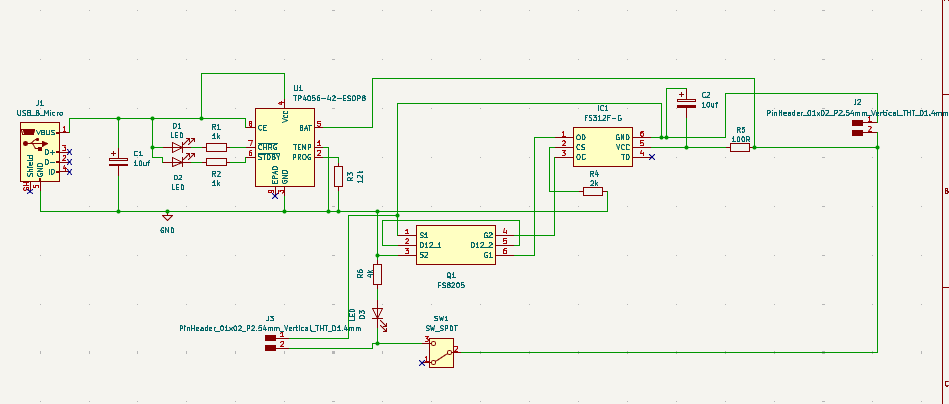
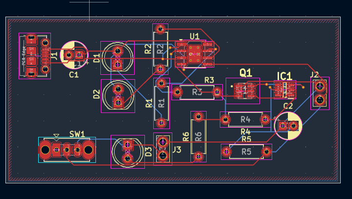
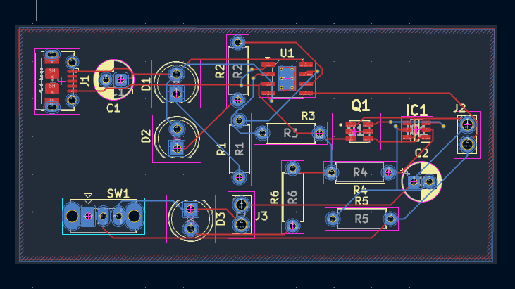
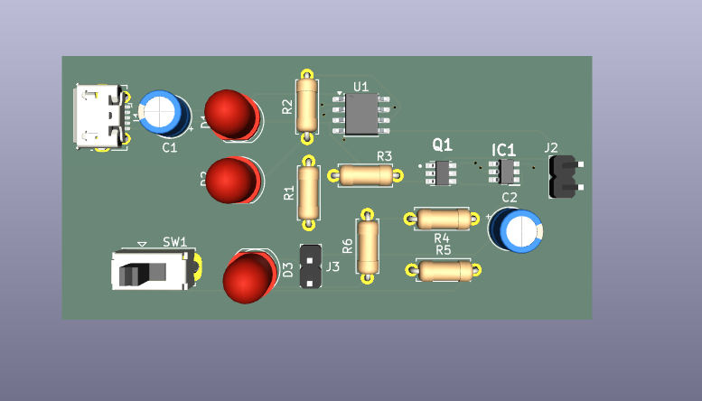

# 18650 Battery Charging PCB Design

## Overview

This project presents the PCB design of a 18650 Lithium-Ion Battery Charging Circuit developed using **KiCad**. The design includes a TP4056 battery charging IC, battery protection circuit, charging status indicators, USB Micro power input, and battery output connector.

The project covers the complete PCB design workflow from schematic design to PCB layout, design verification, and Gerber generation.

---

## Features

- TP4056 Lithium-Ion Battery Charging IC
- USB Micro Power Input
- Battery Protection Circuit
- Charging Status LEDs
- Battery Output Connector
- ON/OFF Slide Switch
- Two-Layer PCB Design

---

## Software Used

- KiCad

---

## Hardware Components

- TP4056 Battery Charging IC
- FS312F Battery Protection IC
- FS8205 Dual MOSFET
- USB Micro Connector
- LEDs
- Slide Switch
- Resistors
- Capacitors
- Pin Headers

---

## Design Flow

1. Schematic Design
2. ERC Verification
3. PCB Layout
4. Component Placement
5. PCB Routing
6. DRC Verification
7. Gerber Generation

---

## Design Verification

- ERC Passed ✅
- DRC Passed ✅
- Gerber Files Generated Successfully ✅
- Ready for PCB Fabrication ✅

---

## Repository Structure

```
18650_Battery_Charging_PCB_Design
│
├── 18650_Battery_Charging.kicad_sch
├── 18650_Battery_Charging.kicad_pcb
├── README.md
│
├── Gerber/
│
└── Images/
    ├── 18650_Battery_Schematic.png
    ├── 18650_Battery_TopLayer.png
    ├── 18650_Battery_BottomLayer.png
    └── 18650_Battery_3D_View.png
```

---

## Project Images

### Schematic



---

### PCB Layout - Top Layer



---

### PCB Layout - Bottom Layer



---

### 3D View



---

## Learning Outcomes

- Designed a Lithium-Ion battery charging PCB using KiCad.
- Learned schematic capture and PCB layout design.
- Practiced component placement and PCB routing.
- Performed ERC and DRC verification.
- Generated Gerber files for PCB fabrication.

---

## Author

**Indhira A**

Electronics and Communication Engineering Student

Interested in PCB Design, Embedded Systems, and IoT.
